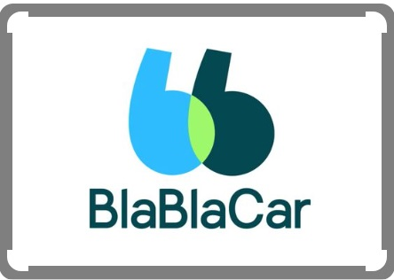
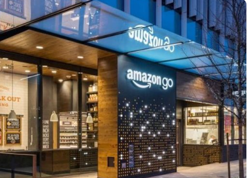

# PEC3: Visionando el futuro con las gafas de Manovich

> **[Blablacar](https://www.blablacar.es/) y [Amazon GO](https://www.amazon.com/-/es/b?ie=UTF8&node=16008589011) a través de las Gafas de Manovich**

**Autor**:  Jose Manuel Canencia Santiago   **Fecha**:  10/05/2024

## INTRODUCCIÓN

### ¿Qué es la hibridación de medios?

La hibridación, según **Lev Manovich**, se produce cuando “Las propiedades y técnicas exclusivas de distintos medios se han convertido en elementos de software que pueden combinarse por vías que antes resultaban imposibles” (Manovich, 2013, p.183). Por tanto, la hibridación es el resultado de la combinación y la fusión de diferentes medios y técnicas que tiene como resultado plataformas y formatos novedosos, los cuales antes no eran posibles sin la capacidad del software moderno. Este concepto de hibridación cambia en gran medida la forma en que entendemos y utilizamos los medios. Anteriormente, cada medio se consumía a través de plataformas distintas y específicas (libros, radio, televisión). En el entorno digital actual, los límites entre medios distintos se vuelven borrosos, se combinan de manera fluida en una única plataforma. Estos medios híbridos se vuelven más complejos y enriquecidos, brindando una experiencia más inmersiva para el usuario. Toda esta transformación, lleva consigo un cambio en la percepción de los medios, surgen nuevas formas de interacción, habilidades de consumo y una redefinición de lo que significa ser un creador y un consumidor de contenido en la era digital. Ejemplos de esta hibridación de medios son las aplicaciones **BlaBlacar** y **Amazon GO**. 

### ¿Cómo reconocemos una hibridación?

Según Lev Manovich, la hibridación de medios supone la fusión de dos o más medios distintos que tiene como resultado un medio completamente **nuevo**, es decir, los elementos de los medios convergentes se integran dando lugar a otro medio, el cual no puede descomponerse fácilmente en sus componentes originales. Esta convergencia introduce nuevas funcionalidades y formas de interacción al medio resultante que no existían en ninguno de los medios originales de forma aislada.

Para reconocer un medio híbrido, debemos buscar ejemplos donde se evidencie una integración de diferentes tipos de medios, con nuevas formas de contenido y funcionalidades que no se puedan atribuir a ninguno de los medios originales. Es precisamente este concepto donde radica la diferencia de un medio híbrido con respecto a multimedia o remediación.

En un medio **multimedia**, los distintos tipos de medios (audio, texto, video) son identificables de forma separada y operan de manera independiente dentro de un mismo entorno. 

**La remediación** en cambio implica tomar un medio existente para ser recontextualizado dentro de otro, manteniendo un vínculo claro con su forma original. 

## [BlaBlaCar](https://www.blablacar.es/) Hibridación en movimiento

**BlaBlaCar** surge en Francia en 2006 como una aplicación de viajes compartidos, facilitando la conexión entre conductores que realizan una determinada ruta y pasajeros hacia el mismo destino que buscan un medio de transporte económico y conveniente. Esta plataforma es un destacado ejemplo de hibridación de medios ya que fusiona elementos de redes sociales donde conductores y pasajeros intercambian experiencias en un sistema de evaluación junto a un sistema de geolocalización. 

Por un lado, el sistema de geolocalización de BlaBlaCar tiene 2 funciones principales: optimizar las rutas de viaje y tejer una red comunitaria conductores-pasajeros. 

Por otro lado, la interfaz de la aplicación integra aspectos de redes sociales tradicionales permitiendo a los usuarios revisar perfiles y puntuaciones de otros usuarios, enviar mensajes y compartir experiencias mediante comentarios, creando un entorno de confianza y colaboración entre los usuarios. Este enfoque híbrido extiende la funcionalidad de BlaBlaCar más allá del transporte, convirtiéndola en una comunidad en movimiento. 

### Comunidad BlaBlaCar 
A través de interacciones como valoraciones o recomendaciones, muy similar a otras plataformas como LinkedIn o TripAdvisor, los usuarios de BlaBlaCar tienen la opción de participar en una comunidad propia a modo de red social. Estas interacciones promueven la implementación de sistemas de recompensas y logros que incentivan la participación y mejora continua del servicio dentro de la comunidad. 

### Hibridación en el uso tecnológico
BlaBlaCar emplea tecnologías avanzadas de geolocalización como el sistema novedoso **‘Boost’**. Mediante esta tecnología, los conductores de BlaBlaCar pueden encontrar nuevos pasajeros en diferentes puntos de su ruta, ya que los viajeros ahora tienen la posibilidad de enviar solicitudes de reserva adicionales una vez que el viaje ya ha comenzado. Esta nueva tecnología implanta una funcionalidad nueva a la aplicación además de las ya existentes como la planificación de rutas, eventos y actividades que pueden interesar a los usuarios en sus destinos. 

Por otro lado, BlaBlaCar emplea las plataformas más robustas para la gestión de pagos entre usuarios, como son PayPal, Visa, MasterCard, Apple Pay y Google Pay. Esto asegura una experiencia de pago segura y eficiente, ofreciendo múltiples opciones para adaptarse a las preferencias de cada usuario. 

 ### Conclusiones
 
BlaBlaCar trasciende su papel como una simple aplicación de carpooling para convertirse en una plataforma **híbrida** que mezcla transporte, tecnología de geolocalización, transacción de pagos y red social. 

Según Lev Manovich, “la hibridación se refiere a la combinación de diferentes estilos y medios para crear nuevos modos de expresión y funcionalidad” (Manovich, 2013, p.194). BlaBlaCar es un claro ejemplo de este concepto de hibridación que combina diferentes tecnologías y establece nuevos modos de interacción y comunicación en los viajes compartidos que van más allá del transporte tradicional. 

## [Amazon GO](https://www.amazon.com/-/es/b?ie=UTF8&node=16008589011) ¡GO Hibridación, GO!

**Amazon GO**, presentada al público por primera vez en 2018 en Seattle, Estados Unidos, es una cadena de tiendas minoristas de Amazon pensada para brindar una experiencia de compra rápida y eficiente. Emplea la última tecnología en inteligencia artificial, sensores y cámaras denominado **"Just Walk Out”** para que los clientes puedan entrar, coger los productos que quieran y salir sin pasar por caja, ya que el importe se carga directamente a su cuenta de Amazon. Esta combinación de diferentes tecnologías y métodos tiene como resultado una experiencia de compra completamente nueva. 

### Just Walk Out... ¿cómo funciona? 

El sistema "Just Walk Out" de Amazon GO funciona principalmente gracias a tres características esenciales:  

>**Identificación del cliente**: para ingresar a la tienda, los clientes escanean un código QR para identificarse. 

>**Detección y seguimiento de productos**: una vez dentro de la tienda, una combinación de cámaras, sensores y algoritmos avanzados de aprendizaje automático (machine learning) detecta y sigue los productos que los clientes retiran de los estantes. 

>**Finalización de la transacción**: al salir del establecimiento, la infraestructura en la nube de Amazon Web Services (AWS) carga automáticamente el costo de los productos a la cuenta de Amazon del cliente y envía un recibo digital, eliminando así la necesidad de pasar por una caja registradora.

### Pero entonces... ¿dónde está la hibridación en Amazon GO? 
En el caso concreto de Amazon GO, la integración de diferentes tecnologías y medios se fusiona para ofrecer una experiencia de compra completamente innovadora, alineándose así con las teorías de Lev Manovich sobre la softwarización de la cultura. 

El uso de machine learning combinado con sensores de peso en las propias baldas, hace posible identificar y seguir los productos en tiempo real con muy poca intervención por parte del cliente. Los sensores detectan cuando un cliente toma o devuelve un artículo, y los algoritmos de machine learning procesan esta información para actualizar automáticamente el carrito de compra en la aplicación. Este sistema elimina la necesidad de escanear productos o interactuar con el personal, ofreciendo así una experiencia de compra fluida y eficiente. 

La recopilación de datos en tiempo real de cada cliente se analiza para personalizar su experiencia en la tienda. Esta información se emplea entre otras cosas, para mejorar la disposición de los productos, personalizar promociones, ajustar el inventario... 

Finalmente, Amazon GO se integra con otros servicios digitales de Amazon, como **Amazon Prime, Amazon Fresh y Alexa**, creando un ecosistema digital propio que ofrece una experiencia de usuario completamente personalizada, donde las compras se simplifican y se optimizan mediante recomendaciones obtenidas del machine learning. 

 ### Conclusiones
 
 Lorem Ipsum..
 
## Bibliografía & Webgrafía

Lorem ipsum..

Historia de BlaBlaCar:  https://blog.blablacar.es/about-us/nuestra-historia  

Todo sobre Blablacar : https://www.motorpasion.com/industria/todo-que-debes-saber-blablacar-plataforma-compartir-coche-referencia-espana  

Tecnologia Boost BlaBlaCar: https://blog.blablacar.es/newsroom/noticias/blablacar-lanza-boost-una-tecnologia-que-duplica-las-posibilidades-de-encontrar-coche-compartido  

Soporte BlablaCar/ Formas de pago/gestion de cobro: https://support.blablacar.com/hc/es/articles/4405735631377-Formas-de-pago-aceptadas  

El Software toma el mando [Lev Manovich, 2013] 

